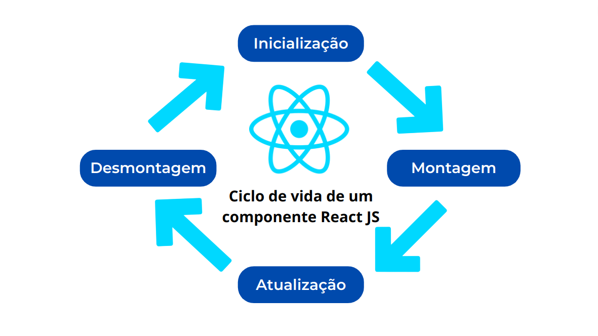

# Repositório LifeCicloComponent

Esse repositório comtém os desafios contidos nas aulas que devem ser enviados por quem assiste de forma assíncrona as aulas e exercícios extras. Desafios esses que visam o ciclo de vida do componente.

## Ciclo de Vida do Componente

