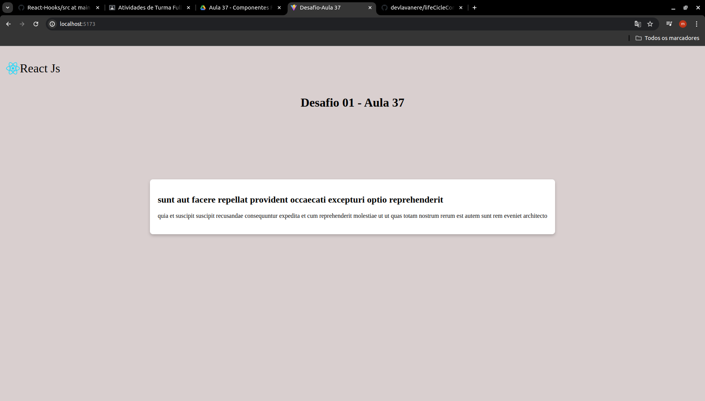

# Desafio Aula 37

## 1- Atualizador Automático de Notícias

- Implementar um componente que busque automáticamente novas notícias a cada 30 segundos;

- Usando useEffect;

- Deve ser importado os hooks useState e useEffect do React.

## Imagem do Desafio

[Visualize o projeto aqui ->](https://life-cicle-component.vercel.app/)