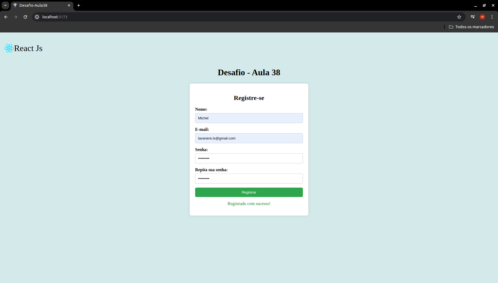

# Desafio Aula 38

## Formulário de Registro

Desenvolver um formulário de registro de usuário que colete informações básicas, como nome, email, senha e confirmação de senha. O formulário deve validar os dados inseridos e exibir mensagens de erro apropriadas quando os dados não forem validados.

Requisitos do Desafio:

Estrutura do Formulário: 

- Campo para nome completo (obrigatório);
- Campo para email (obrigatório e deve ser um email válido);
- Campo para senha (obrigatório deve ter no minimo 8 caracteres);
- Campo para confirmar senha (obrigatório e deve ser igual ao campo senha);
- Botão de Submissão.

Validações:

- Todos os campos são obrigatórios;
- O email deve ter um formato válido(exemplo: usuário@dominio.com);
- A senha deve ter no mínimo 8 caracteres;
- A confirmação da senha deve ser idêntica a senha.

Comportamento do formulário:
- Exibir mensagem de erro abaixo dos campos que não passam por validações,
- Exibir uma mensagem de sucesso ao final do formulário quando todos os dados forem válidos e o formulário for submetido.

## Imagem do Desafio

[Visualize o projeto aqui ->](https://life-cicle-component-2abx.vercel.app/)