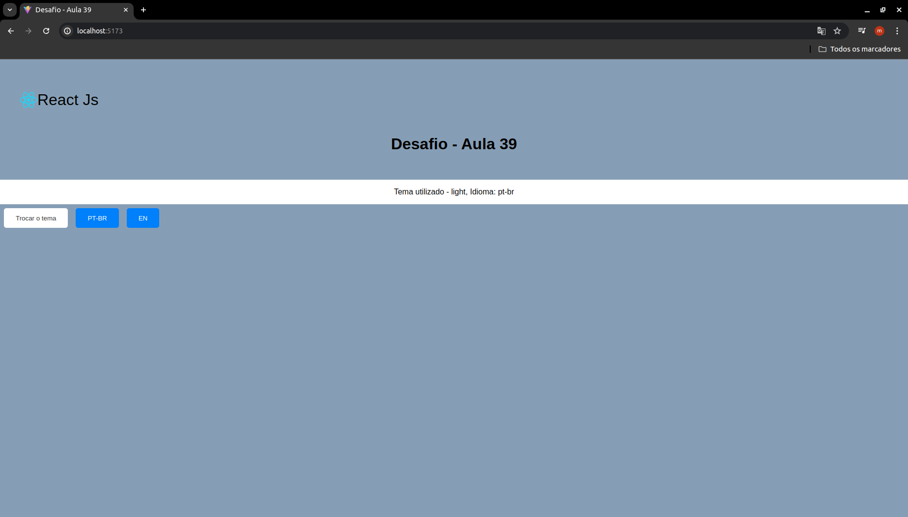
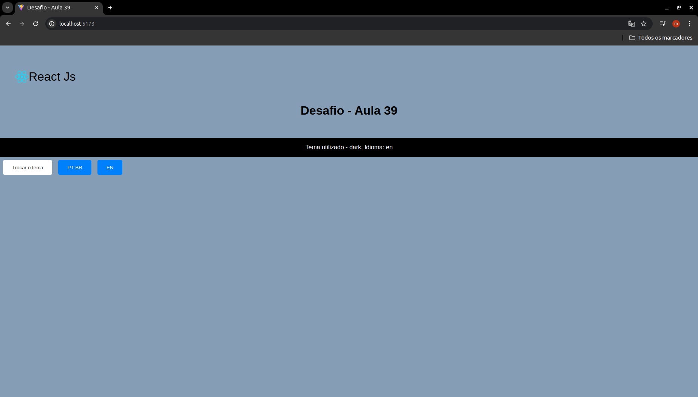

# Desafio Aula 39

## Aplicacativo para Mudar Tema e Idioma

Crie um aplicativo que permite aos usuários escolher e salvar suas preferências de idioma e tema (claro/escuro), usando useContext.

## Imagens do Desafio

