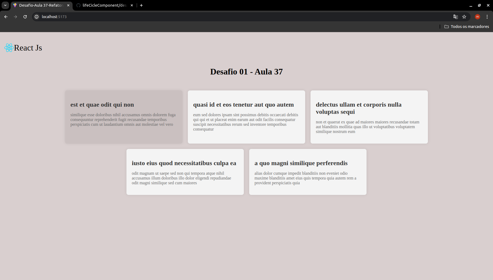

# Desafio Aula 37 / Parte 2

## 1- Atualizador Automático de Notícias

- Implementar um componente que busque automáticamente 5 novas notícias a cada 30 segundos;

- Usando useEffect;

- Deve ser importado os hooks useState e useEffect do React.

## Imagem do Desafio
- Para ter o efeito sombreado basta colocar o ponteiro do mouse em cima do card de notícia.

[Visualize o projeto aqui ->](https://life-cicle-component-qeiz.vercel.app/)